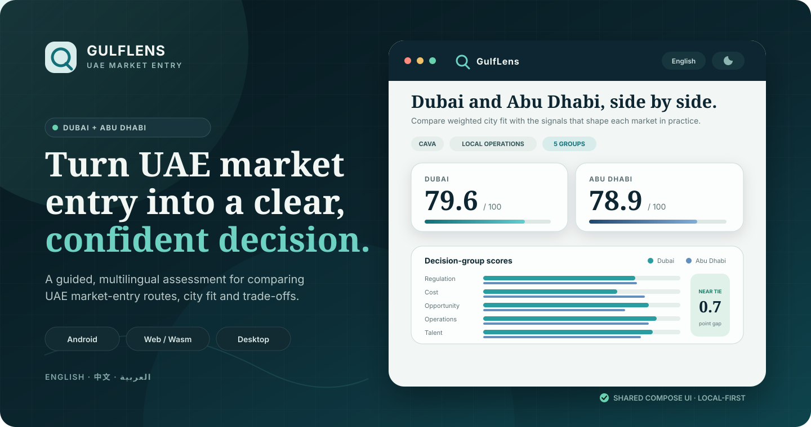
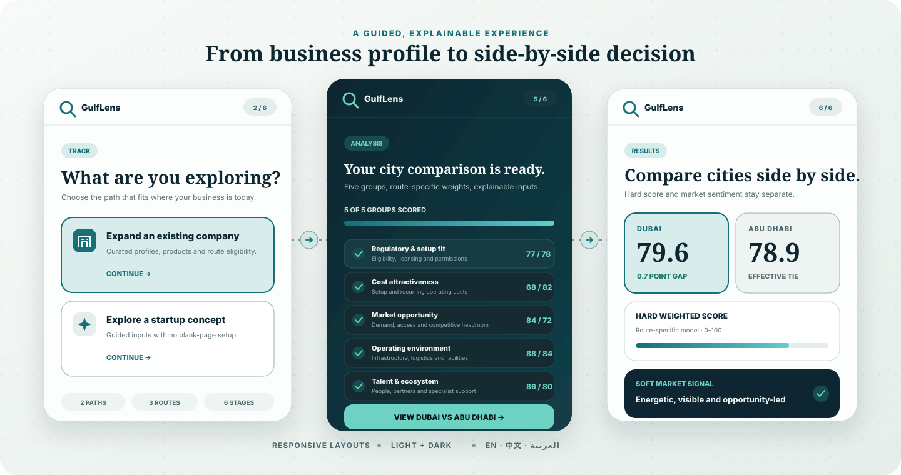
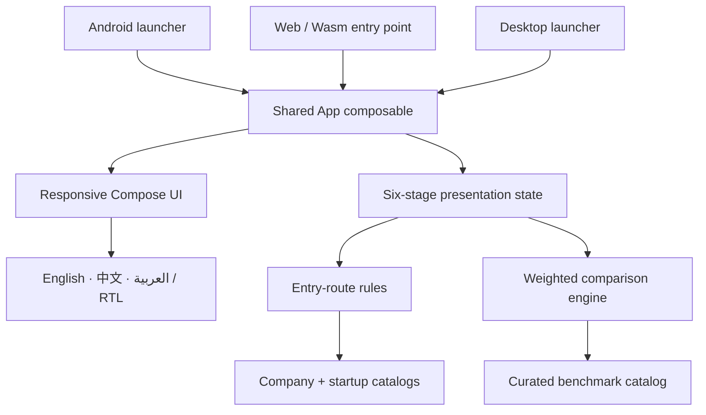

<p align="center">
  <a href="#run-web">
    
  </a>
</p>

<h1 align="center">GulfLens</h1>

<p align="center">
  <strong>One profile. Two cities. A clearer route into the UAE.</strong>
</p>

<p align="center">
  A multilingual decision-support experience for comparing Dubai and Abu Dhabi market-entry scenarios.<br />
  Built once with Kotlin Multiplatform and Compose Multiplatform; delivered on Android, WebAssembly and Desktop.
</p>

<p align="center">
  
  
  
  
  <a href="LICENSE"></a>
</p>

<p align="center">
  <a href="#interface">Interface</a> ·
  <a href="#how-it-works">How it works</a> ·
  <a href="#quick-start">Quick start</a> ·
  <a href="#architecture">Architecture</a> ·
  <a href="#model-scope">Model scope</a>
</p>

---

GulfLens guides operating companies and early-stage ventures from a structured profile to a route-aware, explainable city comparison. The same responsive Compose interface, six-stage state machine, eligibility rules and deterministic scoring engine run across every supported target.

## Interface

<p align="center">
  <a href="docs/assets/gulflens-product-flow.svg">
    
  </a>
</p>

<p align="center">
  <sub>Illustrated interface preview · <a href="docs/assets/gulflens-product-flow.svg">Open full size</a> · <a href="#run-web">Run the interactive Web/Wasm client</a></sub>
</p>

The preview distills the product's current visual system: spacious editorial layouts, route-aware cards, progressive analysis, side-by-side results, responsive breakpoints and a deep navy–teal palette. The application itself renders the shared Compose UI directly—Android does not use a WebView.

### Product highlights

| Capability | What it offers |
|---|---|
| **Two guided journeys** | Expand an established company or shape an early-stage startup concept. |
| **Three entry routes** | Evaluate remote sales, import and distribution, or local operations. |
| **Explainable results** | Inspect five weighted decision groups and their underlying submetrics. |
| **Hard + soft comparison** | Keep the deterministic city-fit score separate from qualitative market sentiment. |
| **Truly multilingual** | Switch between English, Simplified Chinese and Arabic with full RTL layout. |
| **One responsive product** | Use the same light/dark interface on Android, Web/Wasm and Desktop. |

## How it works

GulfLens turns a broad market-entry question into a focused six-stage flow:

| Stage | Experience | What happens |
|:---:|---|---|
| **01** | **Landing** | Set expectations for the guided assessment. |
| **02** | **Track** | Choose an existing-company or startup journey. |
| **03** | **Profile** | Select a curated company or build a structured startup profile. |
| **04** | **Scenario** | Choose a company product and eligible route, or set the startup's first-year planning ranges. |
| **05** | **Analysis** | Watch five decision groups score progressively; expand any group for detail. |
| **06** | **Results** | Compare Dubai and Abu Dhabi through hard scores, weighted breakdowns and soft signals. |

The established-company track includes four representative profiles—CAVA, Warby Parker, Freshpet and Toast—with three product scenarios each. The startup track collects five profile choices and four first-year planning ranges without requiring free-form business-plan input.

## Decision model

The hard comparison is intentionally transparent:

```text
city fit = Σ(decision-group score × entry-route weight ÷ 100)
```

| Decision group | Remote | Import | Local |
|---|---:|---:|---:|
| Regulatory & setup fit | 15% | 20% | 20% |
| Cost attractiveness | 15% | 20% | 25% |
| Market opportunity | 35% | 30% | 25% |
| Operating environment | 15% | 15% | 20% |
| Talent & ecosystem | 20% | 15% | 10% |
| **Total** | **100%** | **100%** | **100%** |

- Profile and product choices determine whether a route is **available**, **conditional** or **unavailable**.
- The selected route changes the weights applied to all five decision groups.
- Eligibility is a gate, not a score.
- Qualitative market sentiment remains visible but is never blended into the hard score.

## Quick start

### Prerequisites

- JDK 21—the repository pins an Azul JDK 21 Gradle daemon
- Android SDK 37 only when building the Android app
- Android Studio or IntelliJ IDEA for IDE-based Android development

No API keys, backend services or project-specific environment variables are required. The first build needs network access to resolve the Gradle distribution, toolchain and dependencies.

```bash
git clone https://github.com/patime07/GulfLens.git
cd GulfLens
```

<a name="run-web"></a>

### Web / WebAssembly

Run the interactive browser experience:

```bash
./gradlew :shared:wasmJsBrowserDevelopmentRun
```

Gradle starts a development server and normally opens the browser. If it does not, use the local URL printed in the terminal. Keep the task running while using the app; stop it with `Control+C`.

Create a production web bundle:

```bash
./gradlew :shared:wasmJsBrowserDistribution
```

The generated site is written to `shared/build/dist/wasmJs/productionExecutable`.

### Desktop

```bash
./gradlew :desktopApp:run
```

Native distribution targets are configured for DMG, MSI and DEB.

### Android

Open the repository in Android Studio, let Gradle sync, select the `androidApp` run configuration and choose an emulator or connected device.

To build the debug APK from the command line:

```bash
./gradlew :androidApp:assembleDebug
```

Android support starts at API 24; the project compiles against and targets API 37.

### Tests

```bash
./gradlew :shared:jvmTest
```

The current test suite focuses on deterministic route eligibility and route-weighted comparison logic.

## Architecture



All product behavior lives under `shared/src/commonMain`; platform modules remain deliberately thin.

```text
GulfLens/
├── androidApp/                 # Android launcher and platform configuration
├── desktopApp/                 # Desktop launcher and native packaging
├── shared/
│   └── src/
│       ├── commonMain/         # Shared UI, state, rules, data, i18n and scoring
│       ├── commonTest/         # Cross-platform domain tests
│       ├── androidMain/        # Android-specific back handling
│       ├── jvmMain/            # Desktop platform hooks
│       └── wasmJsMain/         # Web/Wasm entry point and HTML shell
└── gradle/                     # Wrapper, toolchain and version catalog
```

### Core stack

| Layer | Technology |
|---|---|
| Language | Kotlin 2.4.20 |
| UI | Compose Multiplatform 1.12.0 + Material 3 |
| Targets | Android, Kotlin/Wasm browser, JVM Desktop |
| Async state | Kotlin Coroutines 1.11.0 |
| Build | Gradle 9.5.1 + version catalog |
| Runtime data | Local, curated catalogs; no network dependency |

## Model scope

> [!IMPORTANT]
> GulfLens is a decision-support prototype built on curated demonstration assumptions. It does not use live market data and its output is not a forecast or professional, legal or financial advice.

The current model deliberately separates scenario logic from benchmark data:

- Company, product and startup-profile choices shape route eligibility and scenario context.
- Entry-route selection changes the five metric weights.
- First-year planning ranges do not yet recalibrate the underlying city benchmarks.
- Results currently cover weighted city fit, its five-group breakdown, qualitative market sentiment and a concise verdict.

### Company profile references

The representative company descriptions were prepared with the following official sources:

- [CAVA investor overview](https://investor.cava.com/overview/default.aspx)
- [Warby Parker investor overview](https://investors.warbyparker.com/overview/)
- [Freshpet annual report](https://investors.freshpet.com/static-files/b2292e19-f658-4554-86d0-9e07f1d2a0c5)
- [Toast annual report](https://www.sec.gov/Archives/edgar/data/1650164/000165016426000097/toastinc10k2026v1-final.pdf)

## License

GulfLens is released under the [MIT License](LICENSE). Copyright © 2026 Fz Iguenfer.
